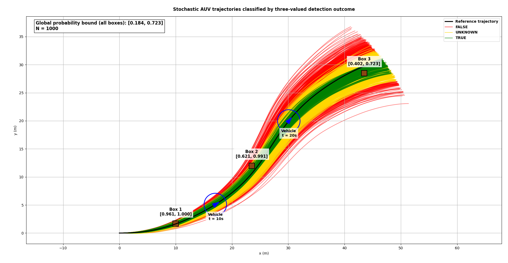
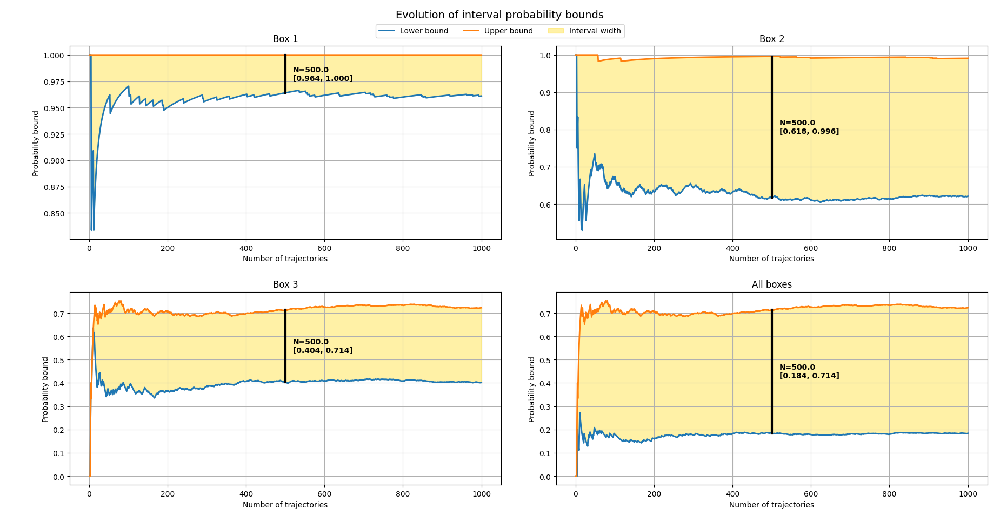

# Interval Monte-Carlo Method (IMCM)

The **Interval Monte-Carlo Method (IMCM)** is a framework designed to **bound the probability of success of a system under uncertainty** by combining **Monte Carlo simulation** (i.e. random sampling) with **interval analysis** and **three-valued logic**.

Unlike classical Monte Carlo approaches that provide pointwise probability estimates, IMCM produces **interval-valued probability bounds** that explicitly account for:
- uncertainties on system states and environment,
- incomplete knowledge of probability distributions,
- and ambiguity in success/failure classification.

The method is particularly suited for applications where:
- uncertainty is naturally described using **set-membership approaches**,
- system behavior is **stochastic or poorly modeled**,
- and guarantees or conservative bounds are required.

This repository provides:
- a **generic C++ implementation** of the Interval Monte-Carlo framework,
- utilities for **set-based classification using interval analysis**,
- and a complete **illustrative example** applied to an **autonomous underwater vehicle (AUV)** mission.

In this example, the method is used to **bound the probability that an AUV successfully observes multiple objects with uncertain positions** during a mission, highlighting the impact of navigation drift and uncertainty accumulation over time.

> ⚠️ **Recommended reading**
>  
> This README contains both practical examples and theoretical explanations.  
>
> For a deeper understanding of the method, it is recommended to first read the **"Theory and Concepts"** section before exploring the example scenarios (see Table of contents to locate the section).

## 📖 Citation

This work has been presented at **OCEANS 2025 Brest** and published in IEEE Xplore.  
If you use this repository in your research, please consider citing:

```
D. Esnault, S. Rohou, F. Le Bars and L. Jaulin, "Bounding the Success Probability of Naval Mine-Clearance Missions Conducted by AUVs," OCEANS 2025 Brest, BREST, France, 2025, pp. 1-8, doi: 10.1109/OCEANS58557.2025.11104600.
```

**BibTeX**
```bibtex
@inproceedings{esnault2025,
author    = {Esnault, Damien and Rohou, Simon and Le Bars, Fabrice and Jaulin, Luc},
title     = {Bounding the Success Probability of Naval Mine-Clearance Missions Conducted by AUVs},
booktitle = {OCEANS 2025 Brest},
year      = {2025},
pages     = {1--8},
doi       = {10.1109/OCEANS58557.2025.11104600}
}
```

🔗 IEEE Xplore: https://ieeexplore.ieee.org/abstract/document/11104600 <br>
🔗 HAL (open access): https://hal.science/hal-05240578

## 📚 Table of Contents

- [⚠️ Project Status](#️-project-status)
- [📦 Dependencies](#-dependencies)
- [🚀 Quick Start](#-quick-start)


- [🌊 OCEANS 2025 Example: Mission Feasibility Analysis](#-oceans-2025-example-mission-feasibility-analysis)
  - [Overview of the Scenario](#overview-of-the-scenario)
  - [Mission Geometry and Uncertainties](#mission-geometry-and-uncertainties)
  - [Three-Valued Logic Interpretation](#three-valued-logic-interpretation)
  - [Results: Probability Bounds Evolution](#results-probability-bounds-evolution)

- [▶️ Reproducing the OCEANS 2025 Results](#️-reproducing-the-oceans-2025-results)
  - [Step 1 — Generate Trajectories](#step-1--generate-trajectories)
  - [Step 2 — (Optional) Visualize Trajectories](#step-2--optional-visualize-trajectories)
  - [Step 3 — Process Trajectories (C++)](#step-3--process-trajectories-c)
  - [Step 4 — Display Results (Python)](#step-4--display-results-python)

- [🗂️ Repository Structure](#️-repository-structure)

- [🧠 Theory and Concepts](#-theory-and-concepts)
  - [Motivation](#motivation)
  - [Three-Valued Monte Carlo Principle](#three-valued-monte-carlo-principle)
  - [Interval-Based Classification](#interval-based-classification)
  - [Empirical Probability Bounds](#empirical-probability-bounds)
  - [Convergence and Interpretation](#convergence-and-interpretation)

- [🔮 Future Work](#-future-work)

## ⚠️ Project Status

This repository provides a **research-oriented implementation** of the Interval Monte-Carlo Method.

- The code is actively used for research and demonstration purposes.
- It is **not intended as a production-ready or fully maintained software**.
- The API and structure may evolve over time without strict backward compatibility.

The current implementation is based on **CODAC v1**.

> 🔧 A future update is planned to ensure compatibility with **CODAC v2**,  
> but no release timeline is defined at this stage.

Users are encouraged to:
- adapt the code to their own needs,
- and use it as a **basis for experimentation and research**.

## 📦 Dependencies

This project relies on the **CODAC ecosystem** and standard scientific Python libraries.

### C++ dependencies

The core implementation is written in C++ and depends on:

- **CODAC** — Contractors, separators, and tubes for set-based analysis  
- **IBEX** — Interval arithmetic library  
- **Eigen3** — Linear algebra library  
- **CMake** ≥ 3.12  
- A C++17 compatible compiler (e.g., `g++`, `clang++`)

> ✅ **Recommended setup**
>
> It is strongly recommended to install **CODAC** by following the official instructions:  
> https://www.codac.io/install/01-installation.html
>
> When CODAC is installed properly:
> - **IBEX** is installed automatically,
> - **Eigen3** is also handled by the installation.
>
> 👉 In that case, no additional installation of IBEX or Eigen is required.

---

### Python dependencies

Python is used for:
- trajectory generation,
- data visualization,
- and result analysis.

The required libraries are:

- `numpy`
- `matplotlib`

These can be installed with:

```bash
pip install numpy matplotlib
```

> ℹ️ The scripts have been developed using a standard Python environment.
>
> You may use either:
> - system Python, or
> - a virtual environment (venv, conda, etc.)

### Notes

The project has been tested with:
- Python ≥ 3.8
- CMake ≥ 3.12

No GPU or special hardware is required.

Performance mainly depends on:
- the number of Monte Carlo samples,
- the resolution used in set-based computations.


## 🚀 Quick Start

This section explains how to **clone, configure, build, and validate** the project with a minimal workflow.

### 1. Clone the repository

Clone the repository **with submodules**, since the project relies on the `Codac-Coverage-Toolbox` submodule:

```bash
git clone --recurse-submodules https://github.com/desnault/Interval-Monte-Carlo-Method.git
cd Interval-Monte-Carlo-Method
```

If you already cloned the repository without submodules, initialize them with:

```bash
git submodule update --init --recursive
```

### 2. Create the recommended `CMakeLists.txt`

To simplify compilation, place the following `CMakeLists.txt` file at the root of the repository:
```cmake
# ==============================================================
# CMakeLists.txt for Interval Monte Carlo Project
# ==============================================================

cmake_minimum_required(VERSION 3.12)
project(interval_monte_carlo_method LANGUAGES CXX)
set(CMAKE_CXX_STANDARD 17)
set(CMAKE_CXX_STANDARD_REQUIRED ON)

# ==============================================================
# ---------------- Project data directory ---------------------
# ==============================================================

set(INTERVAL_MC_DATA_DIR "${CMAKE_SOURCE_DIR}/data")

# ==============================================================
# ----------- Import external libraries ----------------------
# ==============================================================

# IBEX: library for interval arithmetic
find_package(IBEX REQUIRED)
ibex_init_common()  # initialize IBEX common settings
message(STATUS "Found IBEX version ${IBEX_VERSION}")

# Eigen3: linear algebra library
find_package(Eigen3 REQUIRED NO_MODULE)
message(STATUS "Found Eigen3 version ${Eigen3_VERSION}")

# CODAC: library for contractors, separators, tubes, etc.
find_package(CODAC REQUIRED)
message(STATUS "Found CODAC version ${CODAC_VERSION}")

# ==============================================================
# --------- Compile main library (all src/) ------------------
# ==============================================================

# Gather all .h and .cpp files in src/ recursively
file(GLOB_RECURSE SRC_SOURCES
    CONFIGURE_DEPENDS
    "${CMAKE_SOURCE_DIR}/src/*.h"
    "${CMAKE_SOURCE_DIR}/src/*.cpp"
)

# Create static library from all source files
add_library(interval_project_lib STATIC ${SRC_SOURCES})

# Specify the data directory to all project
target_compile_definitions(interval_project_lib PUBLIC
    INTERVAL_MC_DATA_DIR="${INTERVAL_MC_DATA_DIR}"
)

# Include directories for this library
# - Add root src/ folder
# - Add all immediate subfolders of src/ so examples can do #include "Filename.h" without subfolder prefix
target_include_directories(interval_project_lib PUBLIC
    ${CMAKE_SOURCE_DIR}/src
    ${IBEX_INCLUDE_DIRS}
    ${EIGEN3_INCLUDE_DIRS}
    ${CODAC_INCLUDE_DIRS}
)

# Add all immediate subfolders of src/ as include directories
file(GLOB SRC_SUBDIRS LIST_DIRECTORIES true "${CMAKE_SOURCE_DIR}/src/*")
foreach(dir ${SRC_SUBDIRS})
    if(IS_DIRECTORY ${dir})
        target_include_directories(interval_project_lib PUBLIC ${dir})
    endif()
endforeach()

# Apply CODAC-specific compiler options
target_compile_options(interval_project_lib PUBLIC ${CODAC_CXX_FLAGS})

# Link external libraries (CODAC + IBEX)
target_link_libraries(interval_project_lib PUBLIC ${CODAC_LIBRARIES} Ibex::ibex)

# ==============================================================
# ---------------- Compile examples scripts -------------------
# ==============================================================

# Helper function to create executables recursively
function(add_recursive_executables root_dir output_dir)
    # Find all .cpp files recursively in root_dir
    file(GLOB_RECURSE SCRIPT_SOURCES
        CONFIGURE_DEPENDS
        "${root_dir}/*.cpp"
    )

    foreach(script_src IN LISTS SCRIPT_SOURCES)
        # Compute relative path from root_dir
        file(RELATIVE_PATH rel_path "${root_dir}" "${script_src}")

        # Extract filename without extension
        get_filename_component(exec_name ${rel_path} NAME_WE)

        # Extract subdirectory of script relative to root_dir
        get_filename_component(exec_subdir ${rel_path} DIRECTORY)

        # Create target name (to avoid conflicts)
        string(REPLACE "/" "_" target_name "${exec_subdir}_${exec_name}")

        # Create executable
        add_executable(${target_name} ${script_src})

        # Link main library
        target_link_libraries(${target_name} PRIVATE interval_project_lib)

        # Include directories for library headers
        target_include_directories(${target_name} PRIVATE ${CMAKE_SOURCE_DIR}/src)

        # CODAC-specific compiler flags
        target_compile_options(${target_name} PRIVATE ${CODAC_CXX_FLAGS})

        # Include system libraries
        target_include_directories(${target_name} SYSTEM PRIVATE
            ${CODAC_INCLUDE_DIRS}
            ${IBEX_INCLUDE_DIRS}
            ${EIGEN3_INCLUDE_DIRS}
        )

        # Compute final output directory
        set(final_output_dir "${CMAKE_BINARY_DIR}/${output_dir}/${exec_subdir}")
        file(MAKE_DIRECTORY ${final_output_dir})

        # Set executable properties
        set_target_properties(${target_name} PROPERTIES
            OUTPUT_NAME "${exec_name}"
            RUNTIME_OUTPUT_DIRECTORY "${final_output_dir}"
        )
    endforeach()
endfunction()

# Compile examples/ folder (preserve subfolder structure)
add_recursive_executables("${CMAKE_SOURCE_DIR}/examples" "examples")

# Compile oceans2025/ folder (all scripts directly in build/oceans2025)
add_recursive_executables("${CMAKE_SOURCE_DIR}/oceans2025" "oceans2025")
```

This file:
- compiles all source files located in `src/`,
- makes the `data/` directory visible to the C++ scripts through the `INTERVAL_MC_DATA_DIR` definition,
- compiles the example scripts located in `examples/`,
- and compiles the scripts located in `oceans2025/`.

### 3. Build the project

A standard **out-of-source build** is recommended:
```bash
mkdir build
cd build
cmake ..
make
cd ..
```

### 4. Run a simple example to validate the installation

A good first test is the second `IntervalMonteCarlo` example:
```bash
./examples/IntervalMonteCarlo/example2_custom_struct_IntervalMonteCarlo
```

Expected terminal output:
```
Number of trajectory(ies) loaded: 10

Trajectory 1/10:
	Local evaluation: [0, 1]
Trajectory 2/10:
	Local evaluation: <1, 1>
Trajectory 3/10:
	Local evaluation: [0, 1]
Trajectory 4/10:
	Local evaluation: <1, 1>
Trajectory 5/10:
	Local evaluation: <1, 1>
Trajectory 6/10:
	Local evaluation: <1, 1>
Trajectory 7/10:
	Local evaluation: <1, 1>
Trajectory 8/10:
	Local evaluation: [0, 1]
Trajectory 9/10:
	Local evaluation: <1, 1>
Trajectory 10/10:
	Local evaluation: <1, 1>

The estimated interval probability is: [0.6999999999999999, 1.000000000000001]
```

The script loads the trajectories stored in `data/examples` and evaluates whether a target box is fully covered, not covered, or uncertainly covered along each trajectory.

To visually verify the result of each trajectory classification, you can inspect the images provided in:
```
data/examples
```

These images show the trajectory, the covered area, and the box to cover, allowing you to check that the local evaluations are consistent with the geometry.

> ⏳ **Build and runtime note**
>  
> - Compilation may take some time depending on your machine and your CODAC/IBEX installation.
>
> - Most example scripts execute quickly.
>
> - More advanced scripts, especially those relying on fine paving or large Monte Carlo datasets, may require a few minutes.

## 🌊 OCEANS 2025 Example: Mission Feasibility Analysis

This section illustrates the use of the **Interval Monte-Carlo Method (IMCM)** on a realistic scenario inspired by autonomous underwater robotics.

The objective is to evaluate the **probability of success of an inspection mission** conducted by an autonomous underwater vehicle (AUV), in the presence of:
- **uncertainties on object locations**,  
- and **stochastic deviations in vehicle motion**.

The example demonstrates how IMCM can be used to:
- model uncertain environments using **intervals**,
- classify mission outcomes using **three-valued logic**,
- and compute **interval-valued probability bounds** from simulated trajectories.

> ⚠️ **Recommended reading**
>
> This example is detailed and builds upon key concepts of the method.  
> It is recommended to first read the **"Theory and Concepts"** section to understand:
> - the three-valued logic framework,
> - the interval-based classification,
> - and the interpretation of probability bounds.

The complete workflow associated with this example (trajectory generation, processing, and visualization) is described in the section:
👉 **"Reproducing the OCEANS 2025 Results"**.


### Overview of the Scenario

We consider an **inspection mission conducted by an autonomous underwater vehicle (AUV)** operating at constant depth over a flat seabed. The mission objective is to **observe three objects** previously detected during an earlier survey.

The AUV follows a predefined trajectory designed to pass near each object. However, due to navigation uncertainty (e.g., dead-reckoning drift), the **actual trajectory deviates from the nominal one**, making mission success uncertain.

The figure below provides a global overview of the scenario:

<p align="center">
  
</p>

In this figure:
- The **black curve** represents the nominal (reference) trajectory.
- The **colored curves** represent simulated trajectories affected by stochastic perturbations.
- The **three brown boxes** represent uncertain object locations on the seabed.
- The **circular footprints** correspond to the sensing range of the AUV.

Each object is not represented by a single point but by a **2D bounding box**, reflecting uncertainty on its exact position.  

The AUV is equipped with a **range-based sensor**, and an object is considered detected if it lies within the sensor footprint at some point along the trajectory.

This scenario captures a common situation in marine robotics:
- a mission planned using a nominal model,
- executed under uncertainty,
- where success depends on the interaction between **trajectory deviation** and **environmental uncertainty**.

### Mission Geometry and Uncertainties

The mission is defined in a **2D spatial framework**, assuming constant depth and a flat seabed. 

The state of the AUV is described by its planar position and heading, and its motion is modeled using a **Dubins-like kinematic model**:

```math
\mathbf{x}(t) = (p_{x}(t), p_{y}(t), \theta(t), v(t)), \\ 

\mathbf{u}(t) = (u_{\theta}(t), u_{v}(t)), \\ 

\quad\text{and}\quad \mathbf{\dot{x}}(t) = (v(t) \cdot cos(\theta(t)), v(t) \cdot sin(\theta(t)), u_{\theta}(t), u_{v}(t)).
```

where: $\mathbf{x}(t)$ is the state vector of the vehicle and $\mathbf{u}(t)$ is the command vector. The 2D coordinates of the vehicle are represented by $(p_{x}(t), p_{y}(t))$, the heading of the vehicle is represented by $\theta(t)$ and the linear speed of the vehicle is represented by $v(t)$.

#### Object representation

The three target objects are modeled as **uncertain regions** using interval boxes:
```math
\mathcal{B}_i \subset \mathbb{R}^2, \quad i = 1,2,3
```

Each box represents a set of possible positions where the object may lie.

No probability distribution is assumed inside the box: the only available information is that the object is **guaranteed to be somewhere within this region**.

#### Sensor model

The AUV is equipped with a **range-based sensor** of fixed radius $R$.  

At any time $t$, the sensor footprint is modeled as a disk:

```math
\mathcal{D}(t) = \{ x \in \mathbb{R}^2 \mid \|x - p(t)\| \leq R \}
```

where $p(t)$ is the position of the AUV at time $t$.

An object is considered detected if its entire uncertainty box is included in the covered area (i.e. the union of the sensor footprints along the trajectory).

#### Stochastic trajectory model

Although the mission is designed using a deterministic model, the **true AUV motion is stochastic**.

In this example:
- the control inputs are defined as deterministic time-dependent functions,
- but **noise is added to the heading command during integration**,
- resulting in a set of **random trajectories**.

This models a realistic **dead-reckoning navigation behavior**, where:
- small orientation errors accumulate over time,
- and lead to increasing deviation from the nominal trajectory.

#### Implication for mission success

As time progresses:
- the dispersion of trajectories increases,
- and the probability of successfully observing distant objects decreases.

The mission success is therefore not deterministic, but must be evaluated **statistically**, while accounting for:
- spatial uncertainty (object boxes),
- and trajectory variability (Monte Carlo samples).

### Three-Valued Logic Interpretation

In this framework, the outcome of a mission cannot always be classified using a classical binary logic (success/failure).  
Due to uncertainty on object positions and trajectory variability, the result of a simulation may be **ambiguous**.

To address this, IMCM relies on a **three-valued logic**:

- **TRUE**  
  The object is **guaranteed to be observed**, regardless of its exact position within its uncertainty box.

- **FALSE**  
  The object is **guaranteed not to be observed**, for any possible position inside the box.

- **UNKNOWN**  
  The result is **uncertain**: depending on the true position of the object within the box, it may or may not be observed.

---

#### Interpretation in the mission context

For a given trajectory:
- the AUV sensor footprint evolves over time,
- and interacts with each object box.

The classification is performed using **interval-based inclusion tests**:
- if the box is entirely covered by the sensor footprint at some time → **TRUE**
- if it is entirely outside for all times → **FALSE**
- otherwise → **UNKNOWN**

---

#### Multiple-object mission

The mission objective is to observe **all three objects** during a single trajectory.

The global result is obtained by combining individual results using a **three-valued logical AND**:

- If **at least one object is FALSE** → mission is **FALSE**
- Else if **at least one object is UNKNOWN** → mission is **UNKNOWN**
- Else → mission is **TRUE**


This logic reflects the fact that:
- missing a single object leads to mission failure,
- uncertainty on any object propagates to the global result.

---

#### Why three-valued logic?

This approach allows IMCM to:
- **explicitly represent uncertainty** in classification,
- avoid overly optimistic or pessimistic assumptions,
- and produce **robust probability bounds** instead of single estimates.

It is a key difference with classical Monte Carlo methods, where each simulation is forced into a binary outcome.

### Results: Probability Bounds Evolution

Using the simulated trajectories and the three-valued classification, IMCM computes **interval-valued probability bounds** for:

- the detection of each individual object,
- and the detection of all objects during a single mission.

The evolution of these bounds as the number of Monte Carlo samples increases is shown below:

<p align="center">
  
</p>

---

#### Interpretation of the curves

Each subplot represents the evolution of an **interval probability estimate**:

- the **blue curve** is the lower bound,
- the **orange curve** is the upper bound,
- the **shaded area** represents the uncertainty interval.

At any number of samples $N$, the true probability $p$ is estimated to lie within an interval.

> ⚠️ **Important**
> 
> The inclusion of $p$ in the interval is not guaranteed in a deterministic sense.
>
> According to the law of large numbers, the interval contains $p$ almost surely, meaning that the inclusion is expected with high probability, but not strictly guaranteed.

---

#### Convergence behavior

As the number of samples increases:

- the bounds tend to stabilize,
- and the width of the interval generally decreases and stabilizes.

This reflects the empirical nature of the method:

- each new trajectory refines the estimation,
- reducing uncertainty on the probability.

> ⚠️ **Important**
> 
> The convergence is not guaranteed in a deterministic sense.
>
> According to the law of large numbers, the estimator converges almost surely, meaning that convergence is expected with high probability, but not strictly guaranteed.


## ▶️ Reproducing the OCEANS 2025 Results

This section describes how to **reproduce the full OCEANS 2025 scenario**, including:
- trajectory generation,
- Monte Carlo processing,
- and result visualization.

The workflow relies on both **Python** and **C++** components.

---

### Step 1 — Generate trajectories

Generate stochastic trajectories using the Python script:

```bash
python data/main.py
```

This script:

- simulates multiple AUV trajectories (i.e., set to 1000 by default) using a stochastic Dubins car model,
- introduces noise in the heading command (dead-reckoning behavior),
- exports:
    - `.tubevector` files (used by C++),
    - `.txt` files (used for visualization).

The generated data is stored in:
```
data/oceans2025/
├── Perfect/
└── Noisy/
```

---

### Step 2 — (Optional) Visualize trajectories

You can visualize the generated trajectories before processing:
```bash
python data/display_trajectories.py
```

This allows you to:

- inspect the reference trajectory,
- observe trajectory dispersion,
- verify that the simulation behaves as expected.

---

### Step 3 — Process trajectories (C++)

Run the C++ script to:

- classify each trajectory using three-valued logic,
- compute interval probability bounds,
- export results for post-processing.

```bash
./build/oceans2025/main
```

This step:

- loads all `.tubevector` files from `data/oceans2025/Noisy`,
- evaluates detection for each object and for the global mission,
- computes the evolution of probability bounds.

The results are exported to:
```
data/oceans2025/
├── prob_box1.txt
├── prob_box2.txt
├── prob_box3.txt
├── prob_all.txt
└── trajectory_results.txt
```

---

### Step 4 — Display results (Python)

Finally, visualize the results:
```bash
python oceans2025/result.py
```

This script produces two figures:

1) Probability bounds evolution
    - interval estimates as a function of the number of samples
2) Trajectory classification
    - trajectories colored according to:
        - TRUE (green),
        - UNKNOWN (yellow),
        - FALSE (red)

It also displays:

- the object boxes,
- the reference trajectory,
- and the final probability bounds.

> **Notes**
>
> ⏳ The full workflow typically takes a few minutes (~5 minutes).
>
> Execution time depends mainly on:
> - the number of simulated trajectories,
> - and the resolution of interval computations.
>
> ⚠️ If files are missing:
> - ensure that Step 1 and Step 3 have been executed successfully,
> - and that the data/oceans2025/ directory is correctly populated.

## 🗂️ Repository Structure

The repository is organized into four main parts:

```text
Interval-Monte-Carlo-Method/
├── data/
├── examples/
├── oceans2025/
├── src/
└── ...
```

---

### `src/` — Core C++ implementation

This folder contains the main C++ components of the project.

#### `src/BoxInclusionClassifier/`
Implements a classifier used to determine whether a 2D box is:
- fully covered,
- not covered,
- or uncertainly covered

with respect to a separator-defined region.

Main files:
- `BoxInclusionClassifier.h`
- `BoxInclusionClassifier.cpp`

Purpose:
- evaluate geometric detection events under interval uncertainty,
- provide the three-valued logic classification used by IMCM.

#### `src/IntervalMonteCarlo/`
Implements the generic Interval Monte-Carlo framework.

Main files:
- `IntervalMonteCarlo.h`

Purpose:
- process samples sequentially,
- evaluate them with three-valued logic,
- compute an interval-valued empirical probability bound,
- export the evolution of the bound over the number of processed samples.

#### `src/Codac-Coverage-Toolbox/`
This folder contains the **Codac Coverage Toolbox** as a submodule.

Purpose:
- provide set-based tools used in this project,
- especially separators and coverage-related geometric operators.

This submodule is external to the IMCM implementation itself, but is required for several examples and scenario scripts.

---

### `examples/` — Minimal usage examples

This folder contains lightweight C++ examples illustrating how to use the core classes.

#### `examples/BoxInclusionClassifier/`
Examples showing how to classify a box with respect to a geometric set.

Purpose:
- illustrate the difference between full inclusion, exclusion, and uncertainty,
- provide a minimal entry point to understand the `BoxInclusionClassifier` class.

#### `examples/IntervalMonteCarlo/`
Examples showing how to derive and use the `IntervalMonteCarlo` class.

Purpose:
- demonstrate use with simple scalar samples,
- demonstrate use with structured/custom samples,
- show how to process samples one by one or in batches.

These examples are intended as the easiest way to understand the basic usage of the framework before running the full OCEANS 2025 scenario.

---

### `data/` — Python utilities and generated datasets

This folder contains:
- Python scripts used to generate or inspect data,
- example datasets,
- and the trajectory files used by the OCEANS 2025 scenario.

#### `data/dubins_car.py`
A reusable Python class implementing a simple 2D Dubins-car simulator.

Purpose:
- generate deterministic or stochastic trajectories,
- serve as a base model for simulation scripts.

#### `data/main.py`
Python script used to generate the OCEANS 2025 trajectory dataset.

Purpose:
- simulate the reference trajectory,
- generate multiple noisy trajectories,
- export trajectories as:
  - `.txt` files for visualization,
  - `.tubevector` files for C++ processing.

#### `data/display_trajectories.py`
Python script used to visualize the generated trajectories.

Purpose:
- quickly inspect the dispersion of noisy trajectories,
- compare them with the reference trajectory.

#### `data/examples/`
Contains example trajectories and associated images used by the `IntervalMonteCarlo` examples.

Purpose:
- provide ready-to-use sample data,
- allow users to verify example outputs visually.

#### `data/oceans2025/`
Contains the generated dataset and exported results associated with the OCEANS 2025 scenario.

Typical content:
- `Perfect/` — reference trajectory
- `Noisy/` — stochastic trajectories
- exported probability files
- exported trajectory classification file

---

### `oceans2025/` — Complete scenario example

This folder contains the end-to-end mission feasibility example used throughout the README.

#### `oceans2025/main.cpp`
C++ processing script for the OCEANS 2025 scenario.

Purpose:
- load the generated `.tubevector` trajectories,
- evaluate detection of the three uncertain objects,
- compute interval probability bounds,
- export convergence and classification results.

#### `oceans2025/result.py`
Python visualization script for the OCEANS 2025 scenario.

Purpose:
- display the evolution of the four probability bounds,
- display the trajectories colored by mission outcome,
- summarize the final detection probabilities.

#### `oceans2025/mission_overlook.png`
Illustration of the mission scenario.

Purpose:
- show the reference trajectory, noisy trajectories, sensor footprints, and object boxes.

#### `oceans2025/probability_bounds_evolution.png`
Illustration of the probability-bound evolution.

Purpose:
- show how interval estimates evolve as the number of processed trajectories increases.

---

### Root files

#### `README.md`
Main documentation of the repository.

Purpose:
- explain the method,
- describe the repository structure,
- guide installation and usage,
- summarize the theory and the OCEANS 2025 example.

#### `CMakeLists.txt`
Recommended build configuration file.

Purpose:
- compile the library and the examples,
- expose the `data/` directory to the C++ code,
- organize the generated executables.

## 🧠 Theory and Concepts

This section provides a **conceptual and mathematical overview** of the Interval Monte-Carlo Method (IMCM).  
The objective is to formalize how **uncertainty, classification, and probability estimation** are handled within a unified framework.

---

### Problem Setting

We consider a system whose behavior depends on:
- a **stochastic process**,
- and **uncertain parameters** represented by sets (e.g., interval boxes).

Let:
- $\omega$ denote a realization of the stochastic process,
- $x \in \mathcal{X} \subset \mathbb{R}^n$ denote uncertain parameters,
- and $E(\omega, x)$ be a binary event of interest (e.g., detection of an object).

The goal is to estimate the **probability of success**:

```math
p = \mathbb{P}\big( E(\omega, x) = 1 \big)
```

However, in the presence of epistemic uncertainty on $x$, the event $E$ may not be fully determined.

---

### From Binary to Three-Valued Logic

In classical Monte Carlo methods, each realization $\omega$ produces a **binary outcome**:
- success (1),
- or failure (0).

In IMCM, due to uncertainty on $x$, the outcome is evaluated over a set $\mathcal{X}$, leading to a **set-valued event**:

```math
E(\omega, \mathcal{X}) = \{ E(\omega, x) \mid x \in \mathcal{X} \}
```

This induces a **three-valued logic**:

- **TRUE** if $E(\omega, x) = 1$ for all $x \in \mathcal{X}$,
- **FALSE** if $E(\omega, x) = 0$ for all $x \in \mathcal{X}$,
- **UNKNOWN** otherwise.

This classification preserves ambiguity and avoids arbitrary assumptions on the unknown parameters.

---

### Set-Based Classification

The evaluation of $E(\omega, \mathcal{X})$ relies on **set-membership methods**.

Let:
- $\mathcal{S}(\omega)$ denote the success region induced by a realization $\omega$,
- $\mathcal{X}$ the uncertainty set.

The classification is defined as:

```math
\begin{aligned}
\text{TRUE}   &\quad \text{if} \quad \mathcal{X} \subset \mathcal{S}(\omega) \\
\text{FALSE}  &\quad \text{if} \quad \mathcal{X} \cap \mathcal{S}(\omega) = \emptyset \\
\text{UNKNOWN}&\quad \text{otherwise}
\end{aligned}
```

In practice, this is implemented using:
- interval analysis,
- separators,
- and inclusion tests.

---

### Interval Monte Carlo Estimator

Let $N$ be the number of Monte Carlo samples.  

Each sample produces a value in $\{ \text{TRUE}, \text{FALSE}, \text{UNKNOWN} \}$.

Define:
- $N_T$: number of TRUE outcomes,
- $N_F$: number of FALSE outcomes,
- $N_U$: number of UNKNOWN outcomes.

The probability of success $p$ is bounded by:

```math
\frac{N_T}{N} \leq p \leq \frac{N_T + N_U}{N}
```

This defines an **interval estimator**:

```math
p \in [\underline{p}_N, \overline{p}_N]
```

with:
- $\underline{p}_N = \frac{N_T}{N}$,
- $\overline{p}_N = \frac{N_T + N_U}{N}$.

---

### Interpretation

- The **lower bound** assumes that all UNKNOWN cases correspond to failures.
- The **upper bound** assumes that all UNKNOWN cases correspond to successes.

Thus, the interval reflects the **degree of ambiguity** induced by epistemic uncertainty.

---

### Convergence Properties

As $N \to \infty$:
- the estimator converges **almost surely**,
- and the interval typically narrows.

However:
- convergence is not guaranteed in a deterministic sense,
- and the interval width depends on the proportion of UNKNOWN outcomes.

This highlights a key feature of IMCM:
- the method does not artificially reduce uncertainty,
- it explicitly quantifies the remaining ambiguity.

---

### Key Insight

IMCM combines:
- **Monte Carlo simulation** (to handle stochasticity),
- and **interval analysis** (to handle epistemic uncertainty),

within a single framework.

It provides:
- **probability bounds** instead of point estimates,
- a natural handling of incomplete information,
- and a principled alternative to classical probabilistic approaches.

## 🔮 Future Work

This repository provides a first implementation of the **Interval Monte-Carlo Method (IMCM)** and demonstrates its application on a realistic robotics scenario.

Several extensions and improvements are possible:

- **Compatibility with CODAC v2**  
  A future update will aim at adapting the implementation to the next generation of CODAC tools.

- **Performance improvements**  
  Optimizing:
  - trajectory processing,
  - classification routines,
  - and interval computations  

  could significantly reduce execution time for large-scale simulations.

- **Parallelization**  
  Since Monte Carlo simulations are naturally parallel, future work may include:
  - multi-threaded implementations,
  - or GPU-based approaches.

- **More advanced scenarios**  
  Extending the framework to:
  - higher-dimensional problems,
  - multi-agent systems,
  - or more complex sensor models.

- **Theoretical developments**  
  Further work may explore:
  - tighter bounds,
  - convergence analysis,
  - and links with imprecise probability theory.

This repository is intended as a **research and experimentation platform**, and users are encouraged to extend and adapt it to their own applications.

